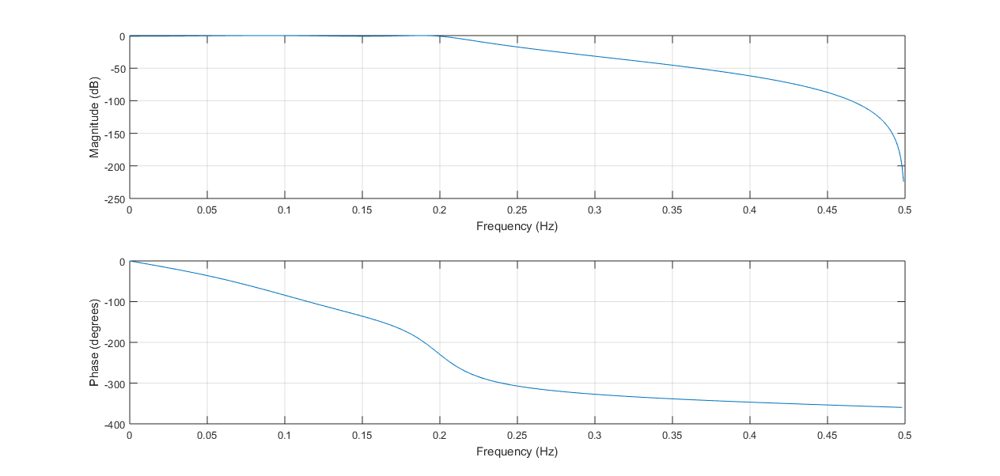
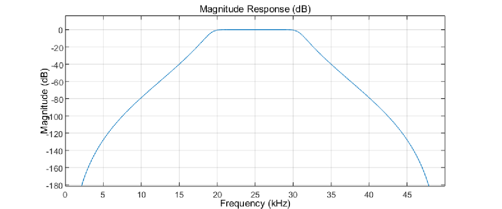
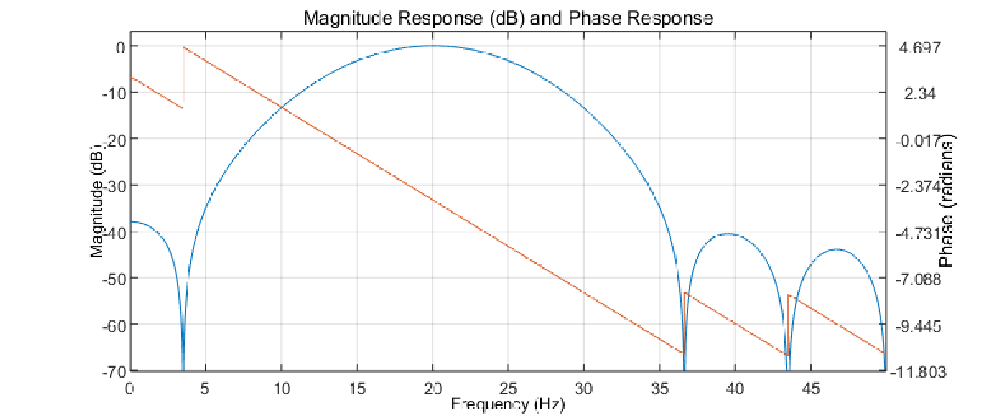
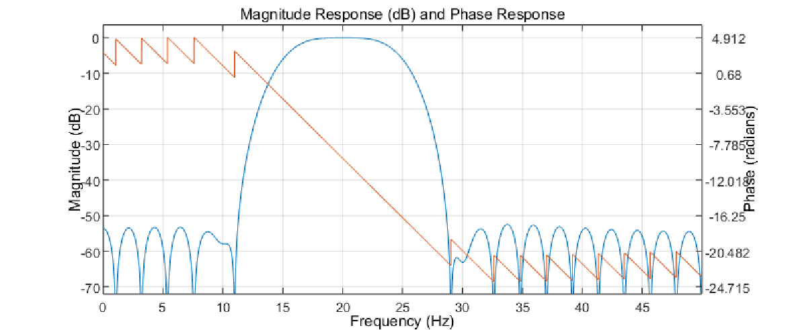
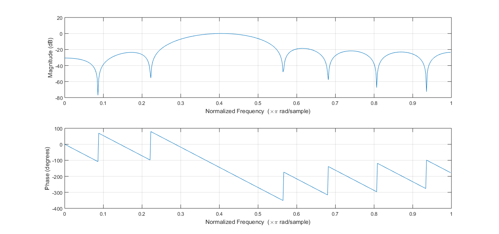
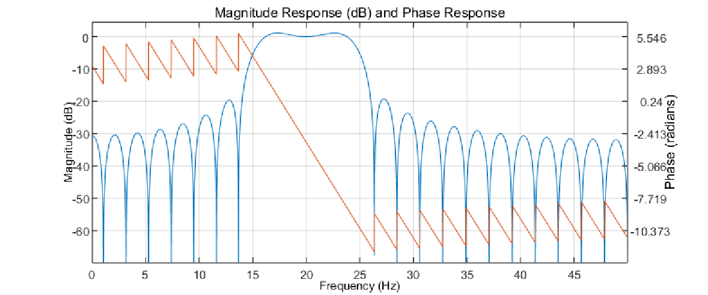
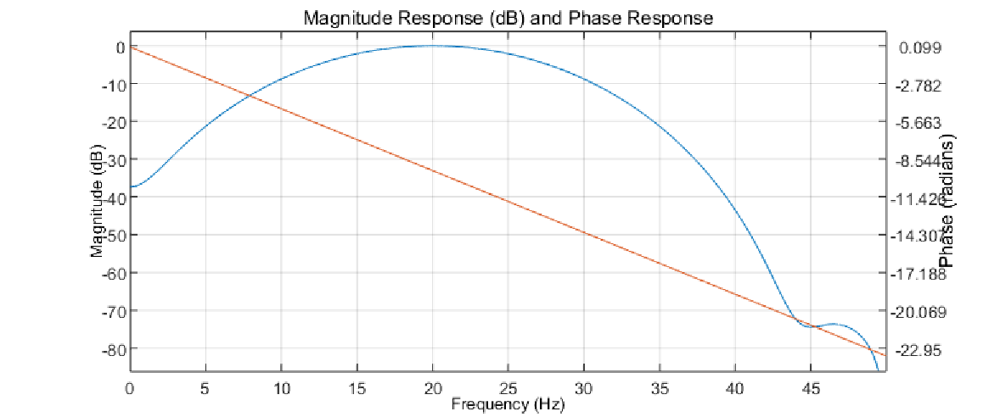
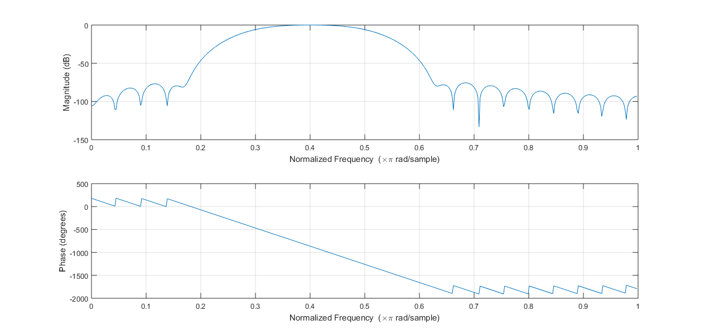
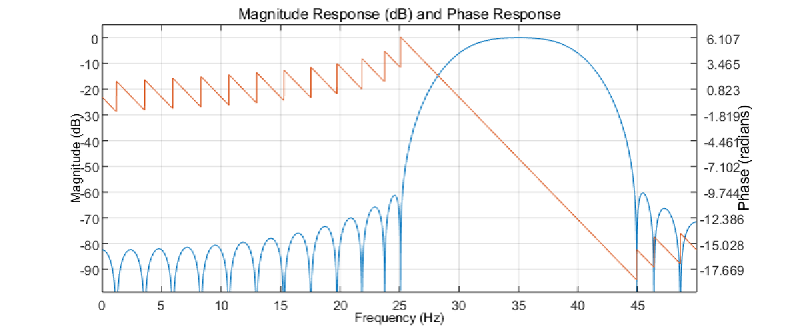
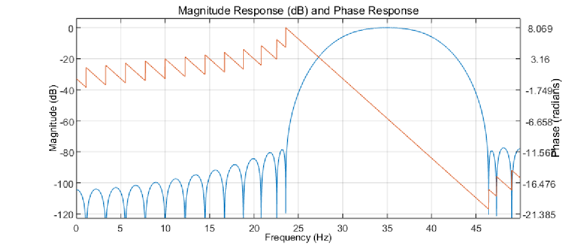

# 
《数字信号处理》课程实验报告

## 
实验3 滤波器设计与滤波器特性分析

#### 
应奇峻 PB15000134

#### 
2019年1月2日

### 1. 实验目的
1. 掌握Matlab下滤波器设计工具(fdatool)的使用方法。
2. 掌握IIR滤波器设计方法与FIR滤波器设计方法。
3. 了解IIR滤波器设计与FIR滤波器设计方法的差异。
4. 掌握滤波器特性分析的方法。
5. 了解Matlab中sptool工具的使用方法。

### 2. 实验原理
本实验利用Matlab的工具fdatool完成。

### 3. 结果讨论
#### 3.1 IIR滤波器设计
##### 1、Chebyshev高通滤波器
根据要求调整fdatool的参数，得出满足条件的Chebyshev高通滤波器的传递函数为$$H(z)=\frac{0.0262(1-4z^{-1}+6z^{-2}-4z^{-3}+z^{-4})}{1+1.5289z^{-1}+1.6537z^{-2}+0.9452z^{-3}+0.2796z^{-4}}.$$幅频特性曲线如下图所示：

显而易见，滤波器满足要求。
##### 2、低通滤波器
根据要求调整fdatool的参数，得出满足条件的低通滤波器的传递函数为$$H(z)=\frac{0.0243(1+4z^{-1}+6z^{-2}+4z^{-3}+z^{-4})}{1-1.5977z^{-1}+1.7459z^{-2}-1.02z^{-3}+0.3074z^{-4}}.$$幅频特性曲线如下图所示：

显而易见，滤波器满足要求。
##### 3、Butterworth带通滤波器
根据要求调整fdatool的参数，得出满足条件的低通滤波器的传递函数为$$H(z)=\frac{0.0002023(1-7z^{-2}+21z^{-4}-35z^{-6}+35z^{-8}-21z^{-10}+7z^{-12}-z^{-14})}{1+3.7738z^{-2}+6.5614z^{-4}+6.6518z^{-6}+4.203z^{-8}+1.6437z^{-10}+0.3666z^{-12}+0.0359z^{-14}}.$$幅频特性曲线如下图所示：

显而易见，滤波器满足要求。
#### 3.2 FIR滤波器设计
##### 1、Hanning窗带通滤波器
根据要求调整fdatool的参数。

$N=15$时，幅频特性曲线如下所示：

实际3dB带宽为，20dB带宽为。

$N=45$时，幅频特性曲线如下所示

##### 2、矩形窗和Blackman窗带通滤波器
$N=15,45$时的矩形窗滤波器如下：

$N=15,45$时的Blackman窗滤波器如下：

比较三者
##### 3、Kaiser窗线性相位滤波器

#### 3.3 滤波器特性分析
基于Blackman床函数的FIR设计方法重新设计三款IIR滤波器。比较幅频特性、相频特性、零极点、群延时、相位延时。
#### 3.4 滤波器的实际运用
### 4. 总结分析
#### 4.1 IIR滤波器和FIR滤波器的优缺点
#### 4.2 实验结论
