# 
《数字信号处理》课程实验报告

## 
实验1 信号及系统基本特性分析

#### 
应奇峻 PB15000134

#### 
2018年10月24日

### 1. 实验目的
1. 学习Matlab编程的基本方法；掌握常用函数用法。
2. 了解不同信号的频域特性，理解时域特性与频域特性之间的关联性。
3. 掌握典型信号序列的时域和频域基本特性。
4. 熟悉理想采样的性质，了解信号采样前后的频谱变化，加深对采样定理的理解。
5. 了解离散系统的时域/频域特性及其对输出信号的影响，掌握系统分析方法。
### 2. Matlab操作与使用
根据所提供的Matlab操作指南学习Matlab的使用。完成文件操作；矩阵运算；绘图；图形界面的实现等功能，学会使用Matlab联机帮助查找信息。
### 3. 理想采样信号序列的特性分析
理想采样信号序列$x_a(n)$，使$A=444.128,α=50\sqrt2π,Ω_0=50\sqrt2π$。对不同的采样频率，观察理想采样信号的幅频特性。
#### (1) 采样频率为1000Hz，T=1/1000

</img>

所得理想采样信号的幅频特性如上图所示。
#### (2) 采样频率为300Hz，T=1/300

</img>

所得理想采样信号的幅频特性如上图所示。观察频谱可以看到，延拓周期变短，相位斜率变大。
#### (3) 采样频率为200Hz，T=1/200

</img>

所得理想采样信号的幅频特性如上图所示。观察频谱可以看到，延拓周期更短，相位谱近似锯齿状，有明显的“混淆”情况。出现混淆情况的原因是采样频率变大且延拓周期减小，产生严重的交叠。
### 4. 典型信号序列的特性分析
#### (1)观察高斯序列的时域和频域特性
高斯序列：$$x_{aa}(n)=\begin{cases}e^{-(n-p)^2/q}&0\leqslant n\leqslant15\\0& others\end{cases}$$
##### ① q取不同值对信号时域特性和幅频特性的影响
$p=8;q=2,4,8$时，信号的时域和频谱特性曲线分别如下所示：

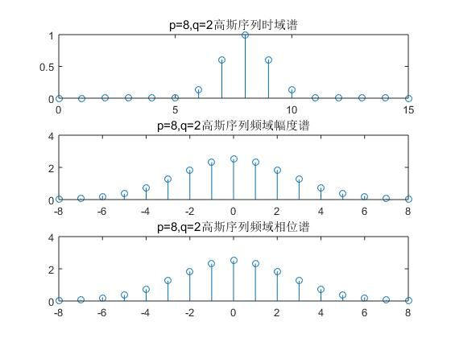</img>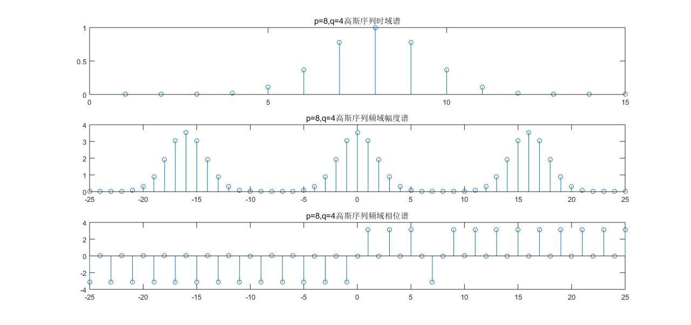</img>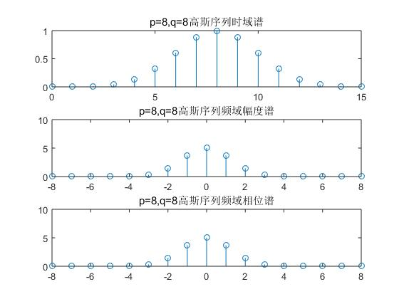</img>

可以看到$q$越大，时域谱越宽，频域谱越窄。
##### ② p取不同值对信号序列时域及幅频特性的影响
$q=8,p=8,13,14$时信号序列时域及幅频特性曲线分别如下所示：

</img>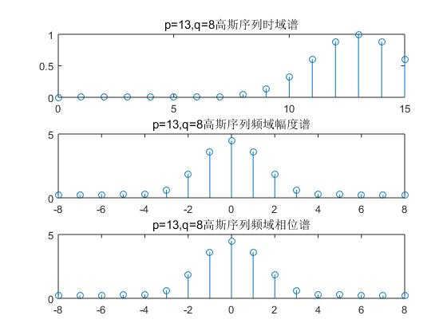</img>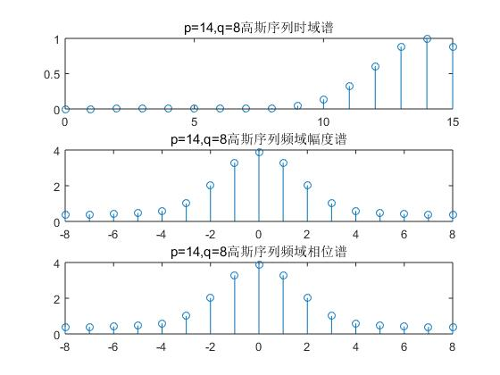</img>

观察到频谱宽度相似。

$p=13$时产生了明显的泄露现象，但混淆的情况并未明显出现——$p=14$时才观察的细微的混淆。
#### (2)观察衰减正弦序列的时域和幅频特性
衰减正弦序列：$$x_{bb}(n)=\begin{cases}e^{-\alpha n}\sin2\pi fn&0\leqslant n\leqslant15\\0&oothers\end{cases}$$
##### ①$α=0.1,f=0.0625$的情形

</img>

$α=0.1,f=0.0625$的情形如上图所示。频谱是双峰谱，并形成周期延拓。波峰出现的位置：
##### ②$f=0.4375,0.5625$的情形

</img>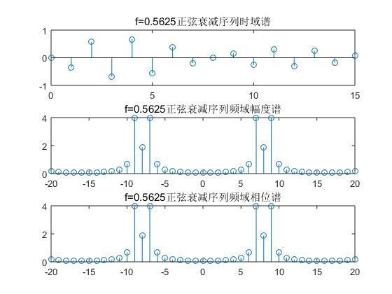</img>

$f=0.4375,0.5625$的情形如上所示。频谱仍然是双峰谱的周期延拓。波峰出现的位置：。没有混淆和泄露的现象。
#### (3)三角波序列和反三角波序列的时域和幅频特性
三角波序列：$$x_{cc}(n)=\begin{cases}n+1&0\leqslant n\leqslant3\\8-n&4\leqslant n\leqslant7\\0&\mathbf{others}\end{cases}$$反三角序列：$$x_{dd}(n)=\begin{cases}4-n&0\leqslant n\leqslant3\\n-3&4\leqslant n\leqslant7\\0&\mathbf{others}\end{cases}$$
##### ①8点FFT分析频幅特性
8点FFT分析分析信号$x_{cc}(n)$和$x_{dd}(n)$，序列和频幅特性曲线如下所示：

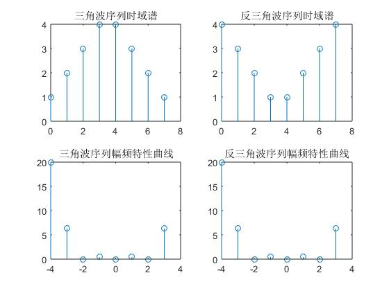</img>

反三角序列可以视作正三角序列圆周移位$T/2$后得到，频幅特性曲线完全相同。
##### ②末尾补零，16点FFT分析幅频特性
将两信号补零后做频域分析，如下图所示。

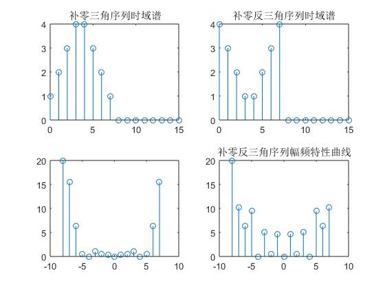</img>

可以明显看到，两者频域发生了明显的区别。其中偶数$k$对应的频谱仍相等。

这说明补零没有增加原有信息量，却能使频谱更加精细，实现信号区分。
### 4. 离散信号、系统和系统响应的分析
##### 信号序列
理想采样信号序列：$$x_a(t)=Ae^{-\alpha t}\sin(\Omega_0nT,0\leqslant n<50)$$单位脉冲序列：$$x_b(n)=\delta(n)=\begin{cases}1&n=0\\0&n\neq0\end{cases}$$矩形序列：$$x_c(n)=R_N(n)\begin{cases}1&0\leqslant n<N-1\\0&\mathbf{others}\end{cases}(N=10)$$
##### 系统单位脉冲响应序列
两种FIR系统：$$h_a(n)=R_{10}(n).\\h_b(n)=\delta(n)+2.5\delta(n-1)+2.5\delta(n-2)+\delta(n-3).$$
#### (1)信号$x_b(n)$和系统$h_b(n)$分析
信号$x_b(n)$和系统$h_b(n)$的时域和幅频特性如下所示：

</img>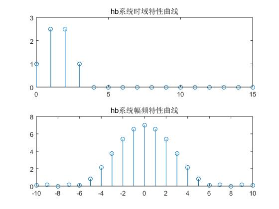

二者线性卷积后的结果如下所示：

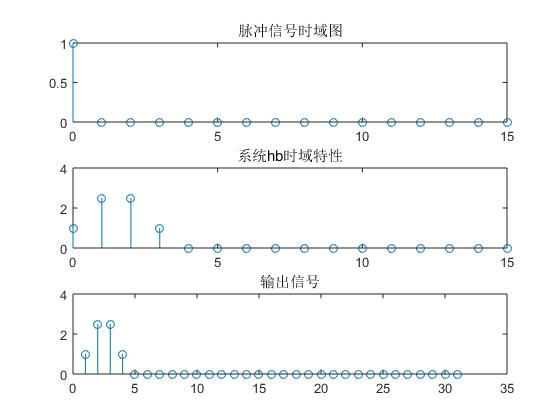</img>

比较系统响应$H_b(k)$和系统$h_b(n)$的时域及幅频特性：

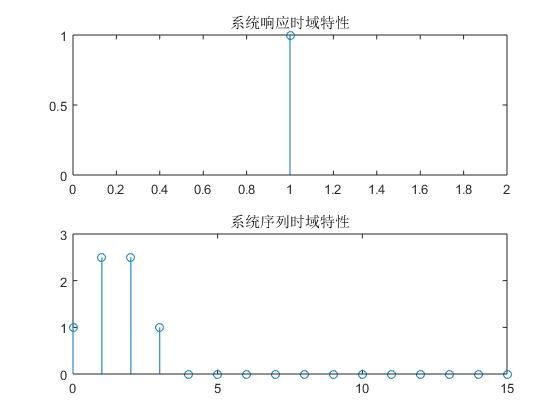</img>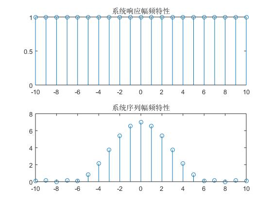</img>

二者差异巨大，因为系统响应只在0点有意义，相当于冲激序列。

同样的结果，其幅频特性曲线也差异巨大：系统响应是无限平稳信号，而后者是一个波包。
#### (2) 信号$x_c(n)$和系统$h_a(n)$分析
信号$x_c(n)$和系统$h_a(n)$的时域和幅频特性如下所示：

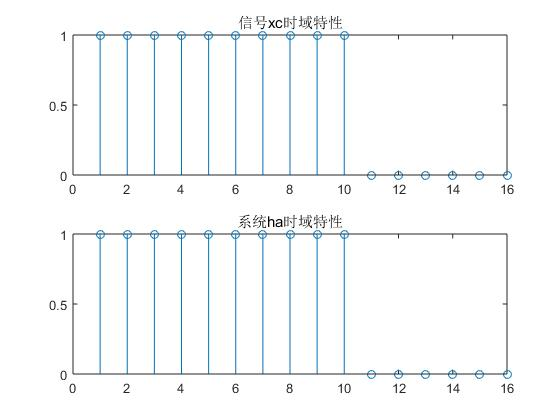</img></img>

利用线性卷积求系统响应。输出信号如下所示：

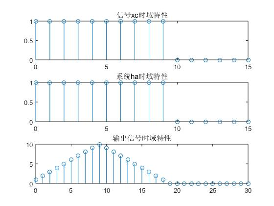</img>

响应序列与理论结果如下图所示，事实证明二者非零长度一致。判断方法是将$Y$与$X\cdot H$比较。二者幅度一致。

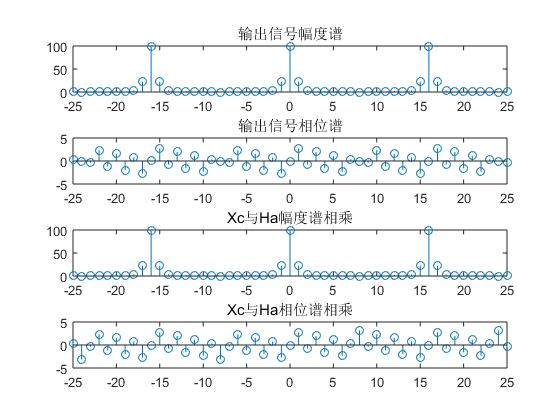</img>

改变信号$x_c(n)$的矩形宽度，使 N=5，重复以上动作，观察变化。

</img></img>

可以看到$x_c'(n)$的频谱变得更宽，变得更低。

对信号和系统做线性卷积，并做响应计算，如下所示。

</img>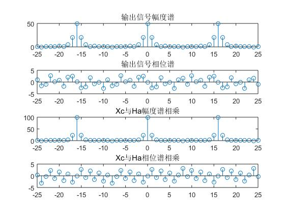</img>

$Y$幅度谱明显宽于$X\cdot H$。存在一定差异。
#### (3) 信号$x_a(n)$和系统$h_a(n)$分析
对信号$x_a(t)$，取参数$A=1,α=0.4,Ω_0=2.0734,T=1$。

信号$x_a(n)$和系统$h_a(n)$的时域和幅频特性如下所示：

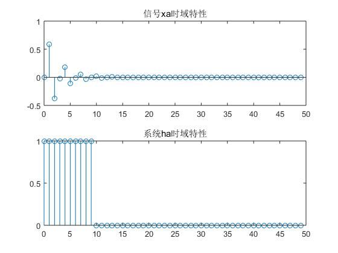</img>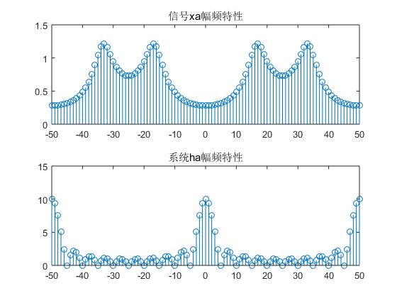</img>

利用线性卷积求系统响应。输出信号如下所示：

</img>

响应序列与理论结果如下图所示，事实证明二者非零长度一致。判断方法是将$Y$与$X\cdot H$比较。因为信号完成补零，二者存在明显差异。

</img>

改变参数$Ω_0=1.2516$，重复以上动作，观察变化。

</img></img>

可以看到$x_a'(n)$的频谱，中间两个峰变得更近，外侧峰变得更远。

对信号和系统做线性卷积，并做响应计算，如下所示。

</img>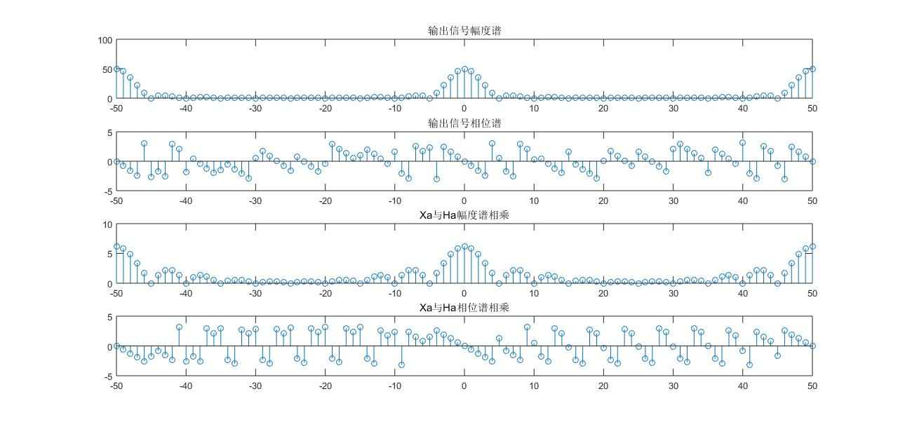</img>

明显看到$Y$幅度谱明显宽于$X\cdot H$。存在一定差异。
### 5. 时域、幅频特性曲线差异总结
- 对于理想采样信号序列，采样频率越小，得到的信息越粗糙，混淆越严重。
- 对于高斯序列，指数比值$q$不会影响信号采样，时间平移$p$会造成泄露和混淆。
-
