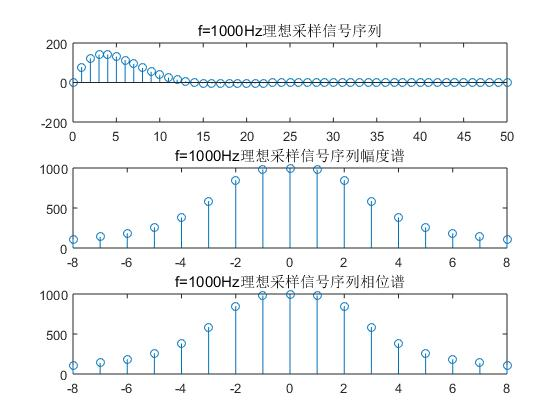
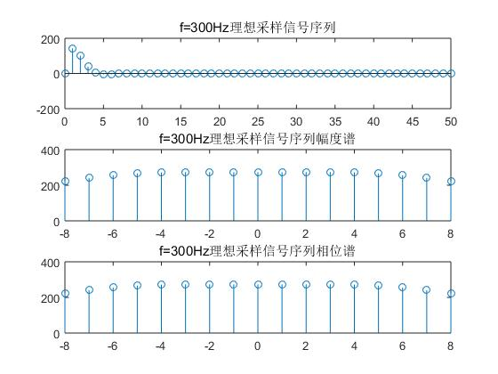
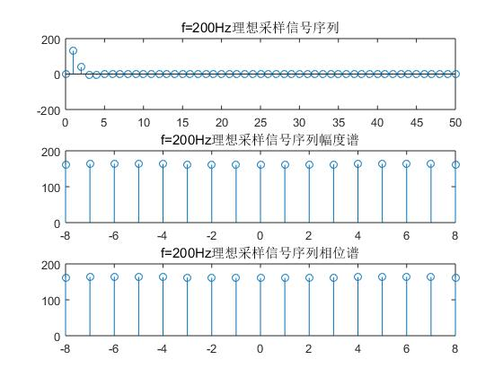

# 
《数字信号处理》课程实验报告

## 
实验1 信号及系统基本特性分析

#### 
应奇峻 PB15000134

#### 
2018年10月24日

### 1. 实验目的
1. 学习Matlab编程的基本方法；掌握常用函数用法。
2. 了解不同信号的频域特性，理解时域特性与频域特性之间的关联性。
3. 掌握典型信号序列的时域和频域基本特性。
4. 熟悉理想采样的性质，了解信号采样前后的频谱变化，加深对采样定理的理解。
5. 了解离散系统的时域/频域特性及其对输出信号的影响，掌握系统分析方法。
### 2. Matlab操作与使用
根据所提供的Matlab操作指南学习Matlab的使用。完成文件操作；矩阵运算；绘图；图形界面的实现等功能，学会使用Matlab联机帮助查找信息。
### 3. 理想采样信号序列的特性分析
理想采样信号序列$x_a(n)$，使$A=444.128,α=50\sqrt2π,Ω_0=50\sqrt2π$。对不同的采样频率，观察理想采样信号的幅频特性。
#### (1) 采样频率为1000Hz，T=1/1000

</img>

所得理想采样信号的幅频特性如上图所示。
#### (2) 采样频率为300Hz，T=1/300

</img>

所得理想采样信号的幅频特性如上图所示。观察频谱可以看到，延拓周期变短，相位斜率变大。
#### (3) 采样频率为200Hz，T=1/200

</img>

所得理想采样信号的幅频特性如上图所示。观察频谱可以看到，延拓周期更短，相位谱近似锯齿状，有明显的“混淆”情况。出现混淆情况的原因是采样频率变大且延拓周期减小，产生严重的交叠。
### 4. 典型信号序列的特性分析
